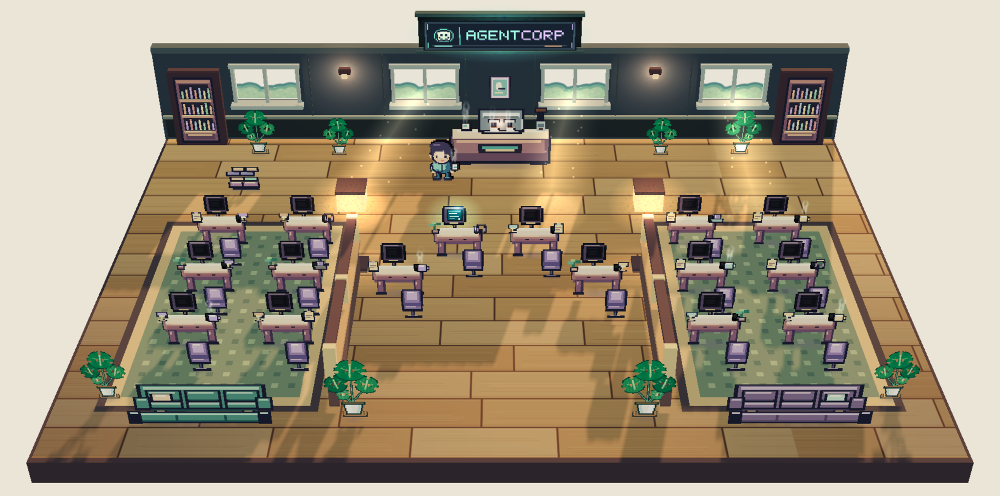

# agentcorp



## Bring your agents to life. 

A cozy office for local Copilot session agents. :) Understand your fleet of agents in a silly new way. 

## Install on this or another device

In a `github copilot app` session of choice, slap this prompt in:

```text
Install the agentcorp-extension from
https://github.com/BranonConor/agentcorp/tree/main/.github/extensions/agentcorp-extension
in my user scope, then open the AgentCorp · Live sessions canvas.
```

The repo-folder URL is the input to the app's `install_extension` flow;
installing from a repo folder copies the portable package into that device's
Copilot extensions. The installer will not overwrite an existing copy. To
update a user-scope install when `main` changes, remove it through the app's
extension management or move `$COPILOT_HOME/extensions/agentcorp-extension/`
outside the `extensions/` directory as a backup. Disabling it without removing
the folder does not free the install path. Reinstall from the same URL, then
reload extensions if they were not reloaded automatically. Keep
`$COPILOT_HOME/agentcorp-observer/artifacts/` intact: it holds local office data
outside the installed package. `$COPILOT_HOME` defaults to `~/.copilot`.

The GitHub repository must be accessible to the device/account, and the
Copilot app must support extension canvases. Do not copy `agentcorp-extension/`
as the install folder: it holds build sources, not the packaged `extension.mjs`
and viewer.

Both project and user copies can launch here. When both are installed, the user
copy owns the canvas; without it, the project copy serves the canvas. Renamed
copies also defer to the canonical user install to avoid duplicate providers.
If the older `agentcorp-observer-viewer` user install is still present, it
continues to own the canvas until you remove it through the app's extension
management; the new copy stays inactive to avoid duplicate providers. Do not
remove the old install during an active session unless you intend to switch.

Every fresh AgentCorp heartbeat under the same local `COPILOT_HOME` appears
automatically in every office, including sessions opened earlier or outside
this repo or an App parent/child tree. No enrollment is needed. A session must
have loaded the extension and be publishing to appear; resume or reload older
sessions that have not started a producer. This does not observe subagents
without their own producer or activity on other devices.

At most 16 sessions are shown. Blocked, tool, and thinking activity take
priority over idle sessions, with a stable session-ID order within each phase;
the office's own session is not guaranteed a desk. Additional fresh sessions
are counted as "more sessions," not rendered as individual agents. Offline
heartbeats are hidden, cleanly stopped sessions disappear, and unrefreshed
heartbeats expire after 45 seconds. Observations include only session IDs and
phases (idle, thinking, tool, blocked), not prompts, code, output, session
titles, or task summaries. The office uses a session/desk subtitle rather
than guessing a current task from private content. Generated agent names label
the office, not the Copilot app's session menu. Storage stays local to the
device's `COPILOT_HOME`, in
`agentcorp-observer/artifacts` outside the installed extension folder.
Older membership records and `extensions/agentcorp-observer/artifacts` files
are left intact but are not used for live discovery.

Agents walk around desks, chairs, sofas and other solid furniture, using
the open aisles rather than crossing through objects. New agents enter from
the lower corners; agents yield in occupied aisles and ease into turns.
They say "Hello!" once when first entering the current viewer.
When a previously visible session disconnects, its avatar waits through a
four-second reconnect grace period and is confirmed still missing, says
goodbye and walks to a front
corner exit before disappearing. A reconnect cancels the departure; being
displaced by the 16-desk display limit does not trigger a false goodbye.
Departing avatars are not included in the connected-session counts.
Occasional bubbles report actual phases, not inferred task results. The gear
button opens four toggles: **Dark Mode**, **Reduced Motion**, **Auto Start** and
**Chat Bubbles**, presented as readable slide switches. Explicit choices persist across extension reloads and changing
viewer ports. Reduced motion follows the OS until explicitly toggled; Chat
Bubbles defaults on, and switching it off hides speech without interrupting
arrivals, reconnect grace or departures. Auto Start affects future session
startup, not the currently open panel.
The observer clock and lighting continuously follow local computer time,
including after sleep or backgrounding. Six-hour previews are temporary offsets
from real time; the fourth preview returns to current local time. Agent movement
keeps its normal speed.

Click an agent in the office or select its full Observed agents row to focus
the camera. Rows work with Enter and Space; selecting the same row again
clears focus. Dragging or scrolling the camera, pressing Escape, closing
Overview, or losing the observed session also clears focus. A selected agent
keeps its identity and desk through activity changes; the office does not
automatically tour agents. Camera movement is eased unless reduced motion is
preferred.

## Automatically open the office

Startup auto-open is disabled by default. To opt in, follow the
[auto-open settings guide](.github/extensions/agentcorp-extension/README.md#automatically-open-the-office).
It opens the office once per canvas-capable session, without a prompt or model
call, and respects existing panels and panels you close.

For the viewer build and tests, see [the source guide](agentcorp-extension/README.md).
